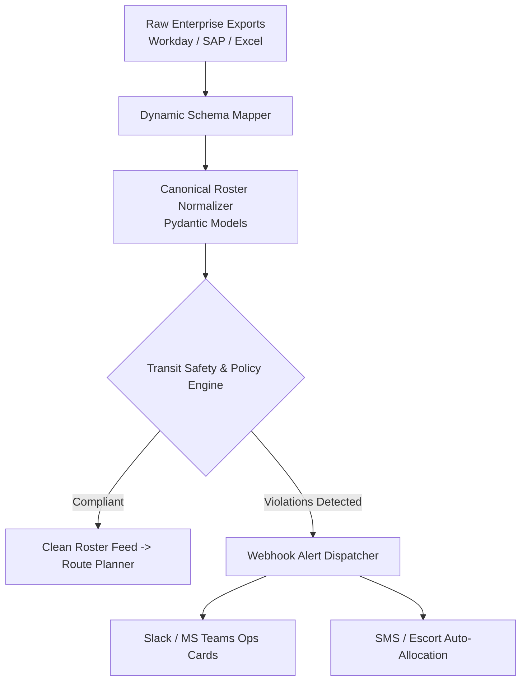

# Enterprise Roster Ingestion & Shift Reconciliation Engine 🚀

[](https://www.python.org/)
[](https://docs.pydantic.dev/)
[]()
[]()

> **Engineered for Enterprise Workplace Mobility & Commute Automation (MoveInSync Context)**  
> Built by **[Mallela Jithendra](https://github.com/jithendra98)**

---

## 📌 Problem Overview
Enterprise clients (e.g., Fortune 500 tech campuses, global capability centers, and 24/7 financial firms) manage thousands of daily employee commutes. However, their input shift data is heavily fragmented across diverse HRMS tools (**Workday, SAP SuccessFactors, Darwinbox, custom spreadsheets**). 

### The Enterprise Pain Points:
1. **Heterogeneous Column Names & Formatting:** Every client exports rosters differently (`staff_id` vs `badge_no` vs `user_id`; `9:00 PM` vs `21:00`).
2. **Strict Transit Safety & Statutory Compliance:** Night-shift transit (8:00 PM – 6:00 AM) requires mandatory security escorts for female employees, geofenced drop addresses, and valid emergency contacts.
3. **Manual Validation Bottlenecks:** Transport dispatch desks spend 30–60 minutes every shift cycle manually cleaning Excel sheets before route generation.

---

## 💡 The Solution
This project provides a **resilient, automated Forward-Deployed Engineering (FDE) pipeline** that bridges enterprise HRMS dumps with workplace transit systems:
* **Dynamic Schema Normalization:** Heuristic and semantic header mapping that translates arbitrary CSV/Excel exports into canonical MoveInSync roster records.
* **Transit Safety Rule Engine:** Autonomous policy evaluation enforcing statutory night-shift escort mandates (`POL-NIGHT-ESCORT`), address completeness, and contact verification.
* **Automated Webhook Dispatch:** Instant construction of Slack / MS Teams operational alert cards for transport dispatch desks.
* **Fail-Safe Quarantine:** Defective rows are isolated without halting pipeline execution for valid employees.

---

## 🏗️ System Architecture



---

## 🚀 Key Features

| Capability | Technical Implementation | Impact |
| :--- | :--- | :--- |
| **Dynamic Schema Ingestion** | Regex synonym mapping + time standardizer | Ingests Workday & SAP rosters with zero manual edits |
| **Statutory Safety Checks** | Temporal & gender-aware rules (`POL-NIGHT-ESCORT`) | 100% compliance with female night commute security laws |
| **Rich Operational Alerts** | Slack Block Kit & Teams Webhook builder | Instant visibility for transport control rooms |
| **Data Integrity & Quarantine** | Pydantic v2 strict typing | Zero pipeline crashes on malformed legacy rows |

---

## 📦 Quickstart & Installation

### 1. Clone the Repository
```bash
git clone https://github.com/jithendra98/enterprise-roster-ai-pipeline.git
cd enterprise-roster-ai-pipeline
```

### 2. Install Dependencies
```bash
pip install -r requirements.txt
```

### 3. Run Pipeline with Sample Workday Roster
```bash
python main.py --input data/sample_raw_roster_workday.csv
```

### 4. Run Pipeline with Sample SAP SuccessFactors Roster
```bash
python main.py --input data/sample_raw_roster_sap.csv
```

### 5. Run Live Webhook Notification
```bash
python main.py --input data/sample_raw_roster_workday.csv --webhook "https://hooks.slack.com/services/YOUR/WEBHOOK/URL" --live
```

---

## 🧪 Running Unit Tests

```bash
pytest tests/ -v
```

All tests validate:
- Cross-format header mapping resilience
- 12h / 24h shift time normalization
- Night-shift female escort policy triggering
- Quarantining of records with missing identifiers

---

## 👨‍💻 Author
**Mallela Jithendra**  
* Email: [mallelajithendra2004@gmail.com](mailto:mallelajithendra2004@gmail.com)  
* GitHub: [@jithendra98](https://github.com/jithendra98)  
* Role Aspirations: **Forward Deployed Engineer (FDE) @ MoveInSync**
